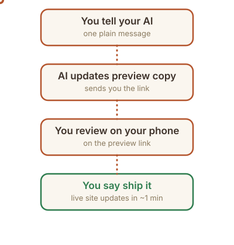

# Your business website

This is **your website**: the files, the words, the photos. It costs about $12 a year (the domain name) plus the AI plan you use, and you update it by *talking*: tell your AI what you want, open the preview link it sends, and say "ship it."

**Not set up yet?** Start with [docs/setup-guide.md](docs/setup-guide.md). You can do it yourself in about two hours, with your AI walking you through every step.

## How updates work

1. **Tap your Edit my website button** and say what you want, the way you'd say it to a person.
2. **Open the preview link** your AI sends. It's your site with the change, on your phone.
3. **Say "ship it."** Your live site updates in about a minute.

Nothing goes live until you say "ship it." Not right yet? Just say what to change, and you get a new preview.

## What to say

- "Change our Saturday hours to 9am to 2pm."
- "Add a banner: we're closed Thanksgiving week, reopening Monday."
- "Add drain cleaning for $129 to the price list."
- "Turn off the testimonials for now."
- "Add a booking button that goes to [your booking link]."
- "What would you change about the homepage?"

Voice notes work too: your AI says back what it heard before it changes anything. More examples: [docs/examples.md](docs/examples.md).

## Made a mistake? Say "undo that"

Every version of your site is saved, so nothing is ever lost. Say **"undo that"** and your AI takes it back: right away if it was the latest change, or with a quick preview if newer changes went live after it.

## What a good AI does

- Tells you what it's about to do *before* doing it, in one or two plain sentences.
- Explains any technical word it uses.
- Ends every change with a preview link you can open on your phone.
- Waits for your "ship it" before anything goes live.
- Asks first before anything risky: your domain, your email, deleting things.

If it isn't doing these, say so. "Explain it like I'm new to this" works remarkably well.

## Good to know

- **Small asks work best.** "Change the headline" beats "redesign the site." Big changes still work; they take a few more previews.
- **Your words win.** If you dictate copy, it goes in exactly as you said it. If your AI rewrites your voice, say "use my words exactly."
- **Real photos beat everything.** [docs/gather-your-stuff.md](docs/gather-your-stuff.md) shows what to shoot.
- **Your files are public, like your website.** Only website content goes in: never passwords, keys, or private notes. Turn location off on photos before you upload them; your AI strips it too.
- **You can't run up a bill.** Hosting is free and nothing on your site bills by usage. The domain renews once a year.
- **Every month: say "run the monthly checkup."** Your AI looks for old hours, tired photos, and broken links, then suggests fixes.
- **Want a logo, a video, or online selling?** Your AI can borrow apps like Canva, Higgsfield, or Shopify: [docs/connectors.md](docs/connectors.md).
- **No AI handy and just a typo?** [docs/editing-in-browser.md](docs/editing-in-browser.md) shows how to fix it on GitHub.com.

## Your first week

- [ ] Finish setup, if your AI says anything is left (it keeps a checklist in `SETUP.md`).
- [ ] Add a few photos and tell your AI your story ([docs/gather-your-stuff.md](docs/gather-your-stuff.md)).
- [ ] Ship three small changes, so the loop feels normal.
- [ ] When you're ready to launch, connect your own domain ([docs/setup-guide.md](docs/setup-guide.md), "Later: your own domain"). Until then your site works on its free address but is hidden from Google.

Questions: [docs/faq.md](docs/faq.md).

## What's in this folder

- `index.html`: your homepage. The words live here.
- `site.config.json`: your business facts (name, hours, address, phone) and which features are on.
- `public/images/`: the photos on your site. `content/brand/`: your shoebox of photos, logo, and story.
- `docs/`: plain-English guides.
- `AGENTS.md` and `rules/`: the instructions your AI follows.
- Everything else is machinery your AI handles. You don't need to open it.

## For the technically curious

A static build (Vite, plain HTML/CSS, no framework) on Cloudflare Pages. `main` is the live site; every other branch gets its own preview link, and a GitHub ruleset makes sure changes reach `main` only through a pull request. The contact form runs on a Pages Function and steps back gracefully without its key. `AGENTS.md` and `rules/` are the operating manual for any AI. If the live site is ever broken and the owner's AI isn't available, a helper can use the emergency rollback in `rules/deploy.md`.
