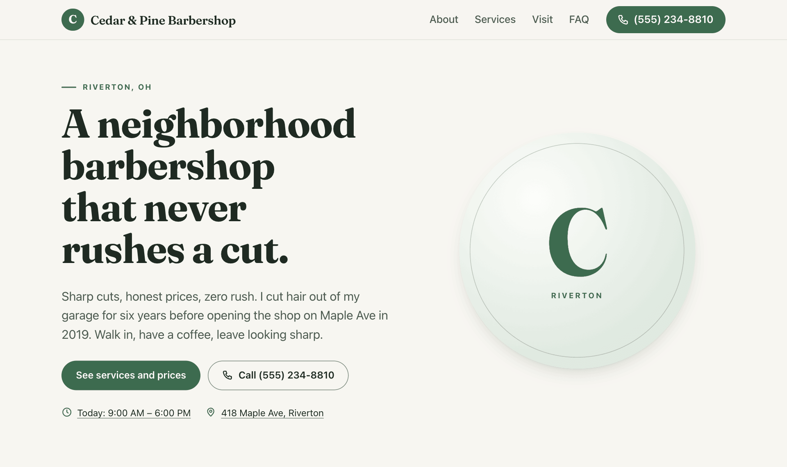
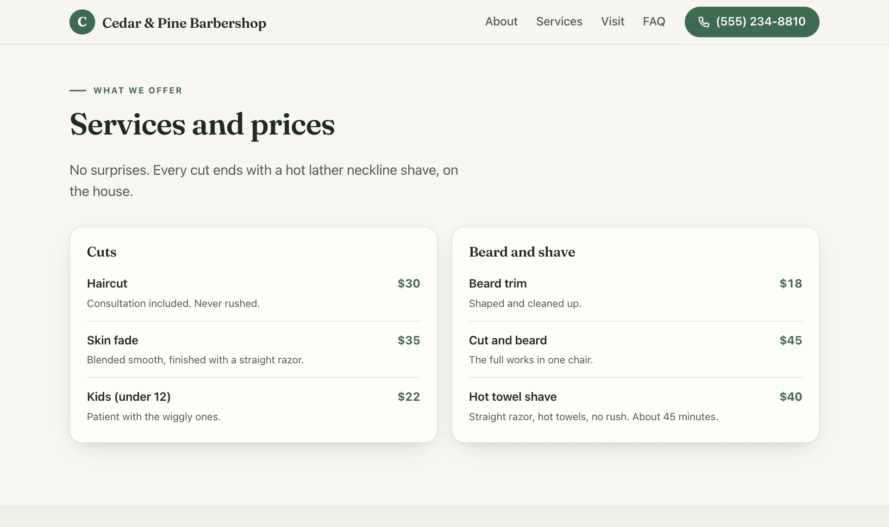

# Everyday updates: what they really look like

Every update is the same three moves: you send **one message**, you open the **preview link** your AI sends back, and you say **"ship it."** Here's what that looks like for Cedar and Pine Barbershop, the made-up shop Main Street was built and tested with.

## What a finished site looks like

Real screenshots of the demo site, not mockups.


*The homepage: the owner's own words, today's hours, and one clear next step.*


*The price list. The owner changes it with one message, like example 2 below.*


*Hours and location: today is marked, and the phone and email are one tap away. (The contact form isn't turned on for this demo, so nothing here can break.)*

## Copy these

Send any of these to your AI as they are, with your own details swapped in:

```
Change my Saturday hours to 9am to 2pm.
```

```
Add drain cleaning for $129 to my services list.
```

```
Put up a banner: Now booking spring cleanups, call for a free estimate.
```

```
Use the storefront photo I just uploaded on the homepage.
```

```
Add a Reviews page with the three reviews I pasted below.
```

That's the whole skill. Below, the same kind of one-liners, slowed down.

## 1. Holiday hours

**You send:** "We're closed December 24 through January 1. Update the site."

**You see:** a preview link a few minutes later. At the top of the page, a line says "Closed Thu, Dec 24 to Fri, Jan 1." Your AI tells you it shows on your live site three weeks ahead, says "Closed today" on those days, and disappears by itself afterwards.

**You say:** "ship it." The live site updates about a minute later.

## 2. A new service with a price

**You send:** "Add a senior cut for $25 under Cuts. One line: Tuesdays and Wednesdays, for our regulars over 65."

**You see:** a new row in the price list, word for word. Your AI never invents a price: the $25 came from you, and it stays exactly as you wrote it.

**You say:** "ship it." Your next customer sees it.

## 3. An announcement banner

**You send:** "Put up a banner: Find our chair at the Maple Ave street fair this Saturday!"

**You see:** a banner across the top of the preview, in your exact words.

**You say:** "ship it." When the fair's over, say "take the banner down." Same loop.

## 4. A new homepage photo

**You upload** the photo to your photos folder on GitHub ([how](gather-your-stuff.md#how-to-add-your-photos)), **then send:** "Use the new storefront photo on the homepage."

**You see:** your photo on the preview homepage, resized so the site stays fast, with its hidden location data removed. Cropped oddly or too dark? Say so, and you get a new preview before anything goes live.

**You say:** "ship it."

## 5. A whole new page

**You send:**

```
Add a Reviews page with these three reviews:
1. "Best fade in town, and he actually listens." (Marcus T.)
2. "Took my son for his first cut. Patient and kind." (Dana W.)
3. "Fair price, no rush, great conversation." (Luis K.)
```

**You see:** a "Reviews" link in the menu, and your three quotes exactly as you wrote them. A whole page takes a few minutes longer than a quick change.

**You say:** "ship it." Google finds the new page over the next few days.

## The pattern

In none of these did you open a dashboard, touch code, or wait on a developer, and the live site was never at risk. Every change waited on its preview until you'd seen it.

1. **Say what you want**, in plain words.
2. **Look at the preview** on your phone.
3. **Say "ship it,"** or say what to change first. Changed your mind later? Say "undo that" and your AI takes it back: right away if it was the latest change, or with a quick preview if newer changes went live after it.

If you can send a text message, you can run your website.
